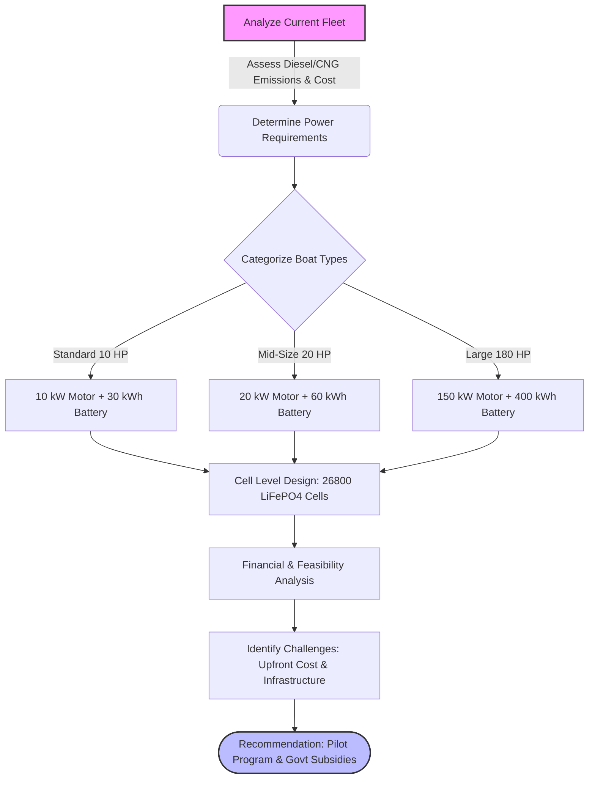

# Assi Ghat Boat Electrification & Lithium-Ion Battery Study

## 📌 Overview
This repository contains a comprehensive set of presentations and analytical reports focused on the fundamental workings of Lithium-ion batteries and a practical feasibility study on electrifying the boat fleet at Assi Ghat, Varanasi. This project was completed as part of the **CHE-291 Chemical Engineering** coursework at **IIT BHU**.

## 📊 Project Flowchart

## 👥 Authors
* **Yash Preetham B M**
* **Yuvraj Jain**
* **Kumar Abhishek**

---

## 📂 Repository Contents

### Part 1: Battery Fundamentals & Mechanics
**1. Why Li-ions Move (`1_Why_Li_ions_move.pdf`)**
* **Thermodynamics:** Explores Gibbs free energy, enthalpy, and entropy regarding battery spontaneity.
* **Quantum Perspective:** Details Fermi levels, HOMO/LUMO, and the stability window of electrolytes.
* **Ion Transport:** Explains solvation, migration, diffusion, and intercalation processes during charge and discharge.

**2. Understanding Batteries (`2_Understanding_Batteries.pdf`)**
* **Market & Performance:** Analyzes market shares and Ragone plots (Energy Density vs. Power Density) comparing Li-ion to Lead-Acid and NiMH.
* **Components:** Breaks down anodes (Graphite/Silicon), cathodes (LFP, NMC, LCO), separators, and electrolytes.
* **Operational Metrics:** Covers working principles, Solid Electrolyte Interphase (SEI), and the significance of C-Rates in charging/discharging speeds.

### Part 2: Applied Feasibility Study (Assi Ghat, Varanasi)
**3. Assi Ghat Boat Electrification Study (`3_Assi_Ghat_Boat_Electrification_Study.pdf`)**
* **Objective:** Evaluates the technical and financial viability of replacing existing diesel/CNG engines with electric propulsion for over 800 boats.
* **Sizing & Specs:** Calculates power requirements (upstream vs. downstream) and battery sizing for Standard (10 HP/30 kWh), Mid-Size (20 HP/60 kWh), and Large (180 HP/400 kWh) boats.
* **Financial Analysis:** Compares initial investments (e.g., ₹7,00,000 for a standard boat) against daily operational savings, estimating a payback period of ~6.3 years.

**4. Assi Ghat Boat Electrification Study - Cell Level (`4_Assi_Ghat_Boat_Electrification_Study_Cell_level.pdf`)**
* **Cell Selection:** Recommends 26800 cylindrical Lithium Iron Phosphate (LiFePO4) cells for thermal stability and longevity.
* **Module Construction:** Details series/parallel configurations (e.g., a standard boat requires 50 modules / 1500 cells).
* **System Challenges:** Highlights the critical role of Battery Management Systems (BMS), cell balancing, matching, and proposes second-life usage for retired marine batteries.

---

## 🚀 Key Takeaways
1.  **Technical Feasibility:** Transitioning to electric marine propulsion is highly feasible and significantly reduces operational costs (estimated daily savings of ₹304 per standard boat).
2.  **Safety & Longevity:** LiFePO4 chemistry is the optimal choice for marine environments due to its high thermal runaway threshold and 3000-5000 cycle lifespan.
3.  **Infrastructure Needs:** Successful deployment requires robust charging infrastructure along the ghats and potential government subsidies to offset high initial capital costs.

## 🛠️ Built With / Concepts Applied
* Thermodynamics & Quantum Chemistry
* Battery Capacity & Load Sizing
* Financial ROI & Payback Period Modeling
* Marine Electric Propulsion Systems

